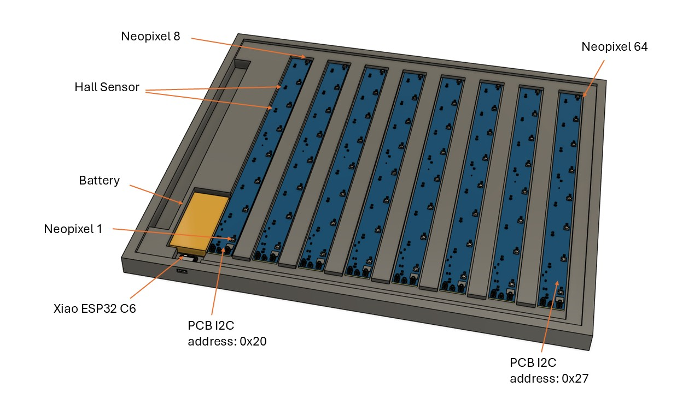
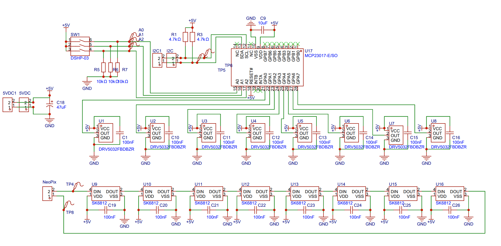

# FSD Remote Chess

## Summary

Remote Chess allows two board players to compete online via a MQTT Broker. Lifting and placing of figures is detected by hall-sensors underneath the squares. The moves are published in an MQTT-topic called /remotechess. Boards subscribed to the topic get the moves from the topic and indicate them with NeoPixel LEDs which are integrated in the squares. Lifting a figure is indicated in red, placing a figure is indicated in green.

## Board

The board has 8 times 8 fields setup in columns A to H and rows 1 to 8. Each field has a hall-sensor and a neopixel RGB LED.

The 64 Neopixel are organized in 8 rows so Fields A1 to H1 have the Neopixel numbers 1 to 8, the fields A2 to H2 have the Neopixel numbers 9 to 18 and so on till the fields A8 to H8 with Neopixel numbers 56 to 64.

The status of 64 hall sensors is detected by 8 PCBs, each of which has a MCP23017 GPIO Board Expander and 8 hall sensors to cover 1 row on the board. The 8 boards are all connected to an I2C bus. The board for the first row has the I2C address 0x27, the board for the second row has the address 0x26 and so on till the last row with board-address 0x20. The hall - sensors are connected to the  Inputs GPA0 to GPA7 of the Board expander, GPA0 corresponds to column A, GPA7 corresponds to column 7. 

##### Note: 

The ESP32 is located near the last row and the Neopixels are counted from there, this means that Fiel A8 (I2C address 0x20, GPA0) corresponds to the first Neopixel. Field H8 (I2C 0x27, GPA7) corresponds to the last Neopixel.

##### Concept



##### PCB Schematic (1x8 Row)



| Quantity | Component     | Comment                |
| -------- | ------------- | ---------------------- |
| 16       | 100nF         |                        |
| 1        | 10uF          |                        |
| 1        | 47uF          | Stabilize Supply       |
| 3        | 10kΩ          | Pull up I2C address    |
| 2        | 12kΩ          | Pull up SDA, SCL       |
| 1        | DSHP-03       | DIP-Switch for Address |
| 8        | DRV5032FBDBZR | Hall Sensor            |
| 8        | SK6812        | Neopixel               |
| 1        | MCP23017-E/SO | GPIO Port Expander     |

#### Module test

The 8 PCBs shall be tested separately before the complete board assembly. To do this the I2C connections (SDA & SCL), the Neopixel data input (DIN) and the 5V input is directly connected to the XIAO ESP32-C6 (s.a. PIN assignement further below).

The test program has 3 steps:

1. Check if one of the permissible I2C addresses from 0x21 to 0x27 is set and print the address found in the serial terminal. 
2. Switch every single of the 8 Neopixel on and off in the 3 RGB colors, only one Neopixel at at a time shall be switched on. The frequency should be 500ms but configurable in a constant called frequency. So the test sequence looks like (Led 1 -> red -> green -> blue -> off, Led 2 -> red -> green -> blue -> off, ...and so on)
3. Switch in a loop which continuously detects the state of the hall-sensors, if a magnet is detected it should show the corresponding LED in green, if no magnet is detected the corresponding LED should be off. The brightness of the LEDs shall be reduced to 40%. Print the number of the hallsensors which detected a magnet in the serial window.

## ESP-Programming

### Program startup

During program startup, after initializing the hardware and before entering the main loop, the board shall perform a visual self-test by displaying the hall sensor status row by row:

1. For each row (1 to 8), read the hall sensor states and light up the corresponding LEDs for 1 second:
   - Fields with a magnet detected (figure present): RED
   - Fields without a magnet (no figure): GREEN
2. LED brightness during this startup routine shall be limited to 40%
3. After displaying a row for 1 second, turn off all LEDs before proceeding to the next row
4. After all 8 rows have been displayed, turn off all LEDs and proceed to the main loop

This startup sequence serves as a visual confirmation that all hall sensors and LEDs are functioning correctly. 

The startup sequence shall also be called when a re-start is triggered.

### Connection indication

After successfully connecting to the MQTT broker and subscribing to the topic, display a brief visual indication that the game is ready to start:

1. Light up D4 and E4 in green (place color)
2. Light up D5 and E5 in red (lift color)
3. Keep LEDs on for 1 second, then turn them off

This pattern indicates the center of the board and confirms the connection is established.

### Detecting and publishing movement

Figure movements is detected by a change in the hall-sensor state and indicated with LEDs, the actions cause MQTT messages to be send. The logic is defined in the state-diagram below.


```

```

**Important:** The state variables LML, LMP and LMK shall only be updated by the MQTT callback when receiving messages, not by the hall sensor scanning function. This ensures that when the board receives its own published message, the LED control works correctly (the callback clears the OLD coordinates before setting the new ones). The hall sensor scanning function shall only update FiguresInAir and publish MQTT messages.

### Receiving and Indicating movement

New messages on topic /remotechess shall trigger the following actions:

| Message format | Action                                                       |
| -------------- | ------------------------------------------------------------ |
| *coordinate*-L | 1. switch the Neopixel corresponding to *coordinate* to red<br />2. set neopixels corresponding to coordinates stored in LML, LMP and LMK to *off* (skip if the variable is empty)<br />3. set values of LMP and LMK to ""<br />4. set value of LML to *coordinate*<br />5. stop the timer "fading" |
| *coordinate*-P | 1. switch the neopixel corresponding to *coordinate* to green<br />2. reset/start the timer "fading" and set it to 20s<br />3. set value of LMP to *coordinate*<br />4. if LMK is not empty, set it to "" and stop the blinking |
| *coordinate*-R | 1. switch the neopixel corresponding to *coordinate* to *off*<br />2. set value of LML to "" |
| *coordinate*-X | 1. switch the neopixel corresponding to *coordinate* to red blinking (200ms frequency)<br />2. set value of LMK to *coordinate*<br />3. reset/start the timer "fading" and set it to 20s |

When the timer fading expires, the Neopixels corresponding to the coordinates stored in LML, LMP and LMK shall be switched to *off* and all LEDs shall be switched to off.

### Moving figures to follow indicated movement

When the player receives a move which is indicated by the red and green LEDs, he is supposed to synchronize the figures on the chess field with the indicated move. This synchronization shall not trigger a MQTT message. As soon as he lifts the figure to be synchronized from the correct position, the red led shall be switched off, when he places the figure on the correct field the green LED shall be switched off. It is important that the "on"->"off" sequence (figure is lifted) and the "off"->"on" sequence (figure is placed) are correctly detected. In case a figure is killed in that move, the destination hall-sensor is "on" in the beginning. The figure to be killed is then lifted (on->off: which should not cause any action) and the new figure is placed (off->on: switching off green destination LED).

### Pin-assignment

The program shall be written in Micropython and suitable for the development board Xiao ESP32-C6. Use the following pins:

| Function | Pin Number |
| -------- | ---------- |
| SCL      | D5         |
| SDA      | D4         |
| Neopixel | D7         |

### Secrets file

The access data (passwords, usernames, keys and IP-addresses) for the the Wifi and to the MQTT broker shall be stored in a dedicated secrets - file.

Time values, Blink-frequency and LED-colors shall be settable at the top of the pro

### MQTT Broker

Use the following MQTT Broker Configuration

```
MQTT_BROKER = "io.adafruit.com"  
MQTT_PORT = 1883                         # Default MQTT port
MQTT_USER = "your_adafruit_username"
MQTT_PASSWORD = "your_adafruit_key"      # Look for key-symbol in your adafruit account
MQTT_CLIENT_ID = "remote_chess_board_1"  # Unique ID for this board
MQTT_TOPIC = "YourUserName/feeds/chess"  # MQTT topic for chess moves, adapt your username
```


### Demo mode

Add a flag DemoMode which can be set at the beginning of the program. In demo-mode the hall-sensors are not connected and no expander boards. In this mode the program shall just check for the updates on the MQTT topic and control the neopixel stripe with 64 LEDs. The received updates and the color and number of the activated neopixel shall be shown in the serial monitor.

## **Progressive Web App (PWA**)

### Summary

The Web App allows the simulation of the real chess board. So one player can use the app and the other player uses the real board. Alternatively both players can use the app or both players can use a real board

### Architecture

The Web App shall be hosted as page in the Git-repository for this project ([Remote Chess](https://jonahpi.github.io/RemoteChess/)). The Web App shall simulate the Chess-board and shall be optimized for an iPhone 16 from the layout. By touching a figure ones it is activated for moving. Touching a field afterwards will place the figure there. In case the destination field was not empty, the destination figure is replaced with the figure which has been selected. When moving the figures no chess rules need to be considered. Touching the figure shall have the same effect as lifting a figure on the real chess box including the MQTT message. The LEDs shall be simulated by small dots on the simulated chess field. 

When starting the program it shall automatically try to connect, when it gets disconnected it shall try to reconnect.

A button called "Zurück" allows to undo the latest action on App. It will move the figures which has been moved by the user back to the last position, the LEDs are switched off and in case another figure has been killed, the figure should be replaced to its original position. "Zurück" only needs to work for one move. the button shall be greyed out when it has been used and re-activated after the next move. When "Zurück" has been clicked, send the message "undo" to the MQTT topic. When receiving the MQTT message "undo", undo the last figure placement.

A button called "Neu starten" will reset the board to the start position. White is on the bottom, black on the top. This will also trigger the startup-sequence and a MQTT message "restart". The MQTT message indicates the other player that the game has restarted. When the ESP32 receives the "restart" message, the startup-sequence shall be triggered.

A button called "Wechsel" shall flip the entire board updside down, so that the player sees the black figures on the bottom and the white figures on the top. Pressing the button again, switches back to the original setup with white figures on the bottom and black on the top.

When the App receives a MQTT message of type *coordinate*-L which has not been triggered by touching a figure in the app itself, this means that the other player has lifted a figure. The App shall then wait for the message that a figure has been placed (*coordinate*-P) and move the corresponding icon from the lift-coordinates to the place-coordinates.

When the lift location and the place location of a pawn is the same and the pawn is in row 1 or in row 8, change the pawn to a Queen, if it is lifted and placed again to the same location, change it back to a pawn. All other figures and pawns in all other rows, shall remain the same when they are lifted and placed on the same location.


### Icon Design

 All chess figures are depicted by simple icons. the Icons for one player shall be black, the ones for the other player white

1. **Black pieces** - Displayed in pure black color (#000)
2. **White pieces** - Displayed in white with a black outline/shadow so they're visible on light squares
3. **Consistent rendering** - All pieces now use the same Unicode symbols but with CSS styling to ensure they look uniform
4. **Black party**: Black icons (♚ ♛ ♜ ♝ ♞ ♟)
5. **White party**: White icons with black outline (♔ ♕ ♖ ♗ ♘ ♙)
6. Enforce the usage of the fonts `Noto Sans Symbols` or `Chess Merida`for rendering the symbols.

### Screen Layout

The chess board shall be square an take the full width of the screen. On the top shall be a status indication which states if the program is still connected to the MQTT Broker. 

Below the chess board, the 3 buttons are placed in the order: Wechsel, Zurück, Neu starten


